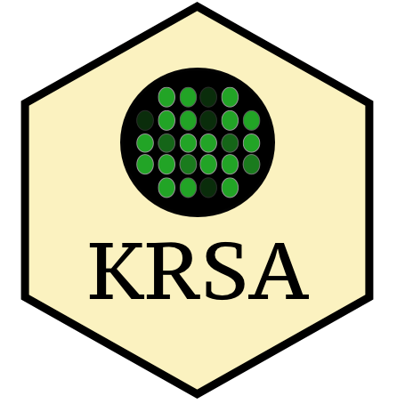
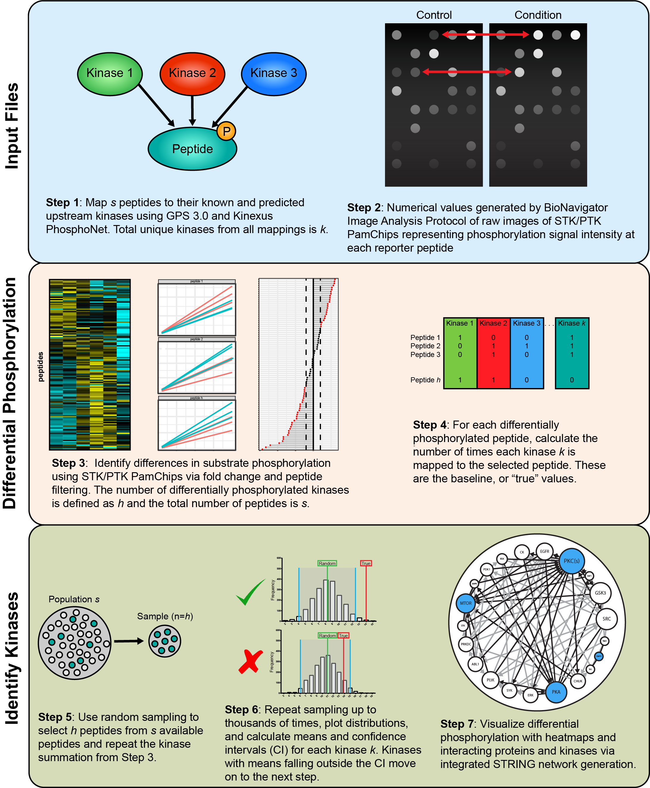
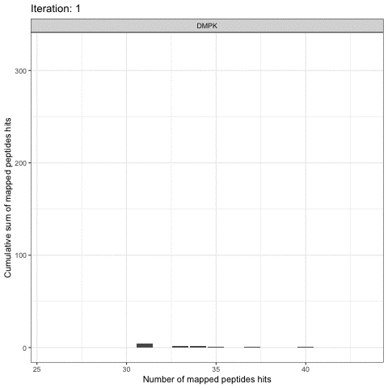
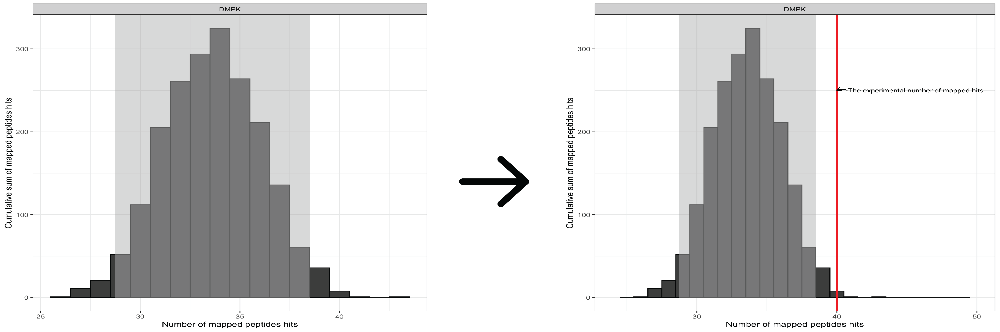

# KRSA: Kinome Random Sampling Analyzer

<!-- badges: start -->

[](https://www.tidyverse.org/lifecycle/#experimental)
[](https://github.com/CogDisResLab/KRSA/actions/workflows/rworkflows.yml)
[](https://github.com/CogDisResLab/KRSA/actions/workflows/pkgdown.yml)
[](https://www.repostatus.org/#active)

<!-- badges: end -->

KRSA is a package designed to analyze the high throughput kinase activity
data generated by the PamGene's PamChip platform. The primary purpose of this package
is to implement a novel way to predict upstream kinase activity based on the
peptide phosphorylation data. In addition to the implementation of the KRSA
algorithm, this package also provides a few convenience methods that allow
users to load, analyze and visualize the PamChip data.

## Installation

This package is available through [CDRL](https://cdrl-ut.org)'s `r-universe` repository.
The easiest way to install a stable version is to use that version.

```r
install.packages("KRSA", repos = c("https://cogdisrelab.r-universe.dev", "https://cloud.r-project.org"))
```

To install the development version of the package, you can install directly from
the GitHub repository.

```r
if (!requireNamespace("remotes", quietly = TRUE)) {
  install.packages("remotes")
}

remotes::install_github("CogDisResLab/KRSA")
```

## KRSA 

Kinome Random Sampling Analyzer, or KRSA, is an R Shiny application that automates many of the steps required to analyze [PamChip](https://pamgene.com/technology/) datasets, including peptide filtering, random sampling, heatmap generation, and kinase network generation. This new software makes analyzing kinome array datasets accessible and eliminates much of the human workload that the previous method required. More importantly, KRSA represents the results in a bigger biological context by visualizing altered kinome signaling networks instead of individual kinases.

More info on the PamChip and the PamStation12 platform can be found here: [PamGene](https://pamgene.com/technology/)

## Package Website

<https://CogDisResLab.github.io/KRSA/>

## Workflow



## Random Sampling Approach

###### Running Random Sampling

<p align="center">
  
</p>

<br /> <br />

###### Calculating Mean, Standard Deviations, and Z Scores

<p align="center">
  
</p>

<br /><br />

## Input Files

The user-supplied kinase-peptide association file and the raw kinome array data file are selected as input. The kinase-peptide associations should be based on the known/predicted interactions found in databases like GPS 3.0 and Kinexus Phosphonet. Expected inputs should be formatted as shown in the example files: vignettes/data_files/example_Median_SigmBg.txt
