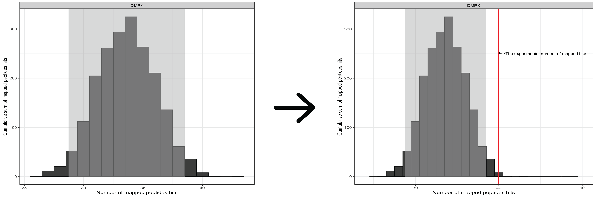

<!-- badges: start -->

[](https://www.tidyverse.org/lifecycle/#experimental) [](https://www.travis-ci.com/kalganem/KRSA) [](https://www.repostatus.org/#active)

<!-- badges: end -->

## Installation

``` r
# install.packages("devtools")
devtools::install_github("kalganem/KRSA")
```

## KRSA 

Kinome Random Sampling Analyzer, or KRSA, is an R Shiny application that automates many of the steps required to analyze [PamChip](%22https://pamgene.com/technology/%22) datasets, including peptide filtering, random sampling, heatmap generation, and kinase network generation. This new software makes analyzing kinome array datasets accessible and eliminates much of the human workload that the previous method required. More importantly, KRSA represents the results in a bigger biological context by visualizing altered kinome signaling networks instead of individual kinases.

More info on the PamStation12 platform can be found here: [PamGene](%22https://pamgene.com/%22)

## Package Website

<https://kalganem.github.io/KRSA/>

## Access

KRSA Shiny App GitHub Repository: [Link](https://github.com/kalganem/KRSA_App)

KRSA preprint is available here: [BioRxiv](https://www.biorxiv.org/content/10.1101/2020.08.26.268581v1)

## Workflow


## Random Sampling Approach

###### Running Random Sampling

<p align="center">
  
</p>

<br /> <br />

###### Calculating Mean, Standard Deviations, and Z Scores

<p align="center">
  
</p>

<br /><br />

## Input Files

The user-supplied kinase-peptide association file and the raw kinome array data file are selected as input. The kinase-peptide associations should be based on the known/predicted interactions found in databases like GPS 3.0 and Kinexus Phosphonet. Expected inputs should be formatted as shown in the example files: inst/extdata/example_Median_SigmBg.txt

# Contact

For technical issues, please start a new issue on this repo: [Link](https://github.com/kalganem/KRSA/issues)

For biological interpretation questions please email: [khaled.alganem\@rockets.utoledo.edu](mailto:khaled.alganem@rockets.utoledo.edu)
