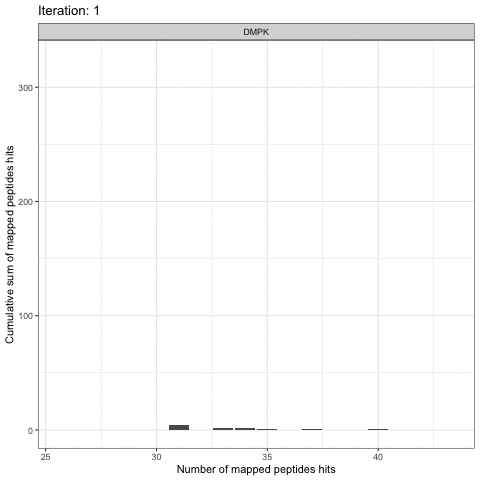
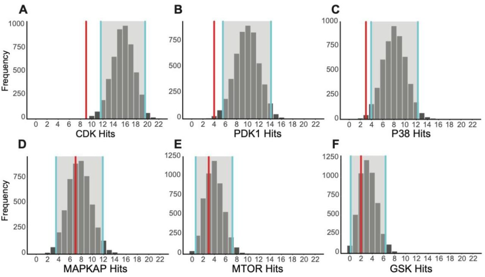

<!-- badges: start -->

[](https://www.tidyverse.org/lifecycle/#experimental)
[](https://www.travis-ci.com/kalganem/KRSA)

<!-- badges: end -->

## Installation

``` r
# install.packages("devtools")
devtools::install_github("kalganem/KRSA")
```

## KRSA 

Kinome Random Sampling Analyzer, or KRSA, is an R Shiny application that
automates many of the steps required to analyze
[PamChip](%22https://pamgene.com/technology/%22) datasets, including
peptide filtering, random sampling, heatmap generation, and kinase
network generation. This new software makes analyzing kinome array
datasets accessible and eliminates much of the human workload that the
previous method required. More importantly, KRSA represents the results
in a bigger biological context by visualizing altered kinome signaling
networks instead of individual kinases.

More info on the PamStation12 platform can be found here:
[PamGene](%22https://pamgene.com/%22)

## Access

KRSA preprint is available here:
[Paper](%22https://www.biorxiv.org/content/10.1101/2020.08.26.268581v1%22).

KRSA Shiny App Repo: [Link](https://github.com/kalganem/KRSA_App)

## Workflow


## Random Sampling Approach

###### Running Random Sampling

<p align="center">

</p>

<br /> <br />

###### Calculating Mean, Standard Deviations, and Z Scores

<p align="center">

</p>

<br /><br />

## Input Files

The user-supplied kinase-peptide association file and the raw kinome
array data file are selected as input. The kinase-peptide associations
should be based on the known/predicted interactions found in databases
like GPS 3.0 and Kinexus Phosphonet. Expected inputs should be formatted
as shown in the example files: data/datasets/DLPFC_MvsF_STK.txt and
data/sup/FinalMappingSTK.txt. Descriptions of pre-processing
requirements, software use, and downstream validation techniques can
also be found at the associated project GitHub.

## Interface and Use

We wanted to have a user friendly interface so we designed KRSA to be as
a dashboard where each tab represents a step of the analysis

## Tabs

### Step1: Options

This tab lets you preview your uploaded data and select the groups
classifications for the input samples can be determined through
drop-down menus which allow for clustering of samples within and across
chips.

### Step2: Stringency

#### QC steps:

Including minimum exposure intensity \> 2 at the last exposure time in
the cycle (200 ms) and linearity of the post-wash curve as determined by
linear regression (R2 \> 0.9), are provided to reduce the total number
of peptides evaluated to those meeting the quality control standards
desired by the user, with these peptides denoted as s.

#### Fold Change Threshold:

Fold change thresholds are selected to identify differentially
phosphorylated peptides (h, or “hits”) between selected groups. KRSA has
a default cutoff of ± 35% as a fold change threshold, though
modification should be made in cases where the bar for biological
significance is substantially higher or lower. Line plots displaying the
phosphorylation intensity in the post-wash phase for each sample are
generated to allow for visual inspection of the selected peptides before
proceeding to the next step to ensure linearity and sufficient magnitude
of phosphorylation for each differentially phosphorylated peptide.


### Step3: Iteration

Random Sampling: KRSA performs random sampling of the available peptides
on the kinase array to get distributions for associated kinase-peptide
interactions. The number of iterations of sampling (i), between 0-5000,
is selected by the user, where higher i values increases the stability
of the kinase predictions while also increasing the run time of the
software. For each iteration i, the same number of peptides as h are
randomly selected without replacement from s available peptides (these
randomly selected peptides are denoted as h’).

### Step4: Results and Step5: Histogram

When the sampling is complete, a distribution for each kinase is
determined from the mean number of times each kinase was predicted based
on the randomly sampled peptides and the corresponding confidence
interval. The number of times a kinase is mapped to h (the
differentially phosphorylated peptides) is also determined, and
comparison of this kinase count to the mean kinase count from sampling
allows us to determine differential kinase activity through a Z-score \>
2 (alpha-level = 0.025).

Results of the above calculations are provided in tabular form (Step4:
Results), sorted in decreasing order by Z-score. Kinases appearing at
the top of this table are those that are most likely to have significant
alterations in activity between the control and the experimental groups.
This table can be directly saved within the KRSA software for inclusion
in publications.

Histograms (Step5) displaying the distribution of mappings for each
kinase after random sampling are provided, with the h mapping (vertical
line), h’ averages (bars), and h’ confidence interval (gray translucent
region) overlaid. Histograms of kinases with h averages outside of the
confidence interval in either direction are considered significantly
altered and match the kinases shown in the tabular output.



### Step6: Heatmap

Heatmap of Differential Phosphorylation: A user-customizable heatmap,
generated using the R package ‘gplots2’, visualizing the fold-change
differences for each peptide is provided and sorted in descending order.
This heatmap can be saved as a PDF or image file directly within the
KRSA software.


## Step7: Network

A network diagram connecting h kinases to predicted interacting proteins
or kinases is generated using the Search Tool for Retrieval of
Interacting Genes/Proteins (STRING) database data and graphed with the
‘igraph’ package in R (Szklarczyk et al., 2017). The generated network
represents the direct interactions between protein kinases identified
from KRSA, as well as additional kinases indirectly connected to the
original seed kinases. STRING was used for growing and connecting the
kinase network by selectively adding interacting kinases with the
highest confidence interaction score. Because of the highly interactive
and repetitive structure of kinase activity, we weighted the nodes of
the network based on the number of interactions found for each kinase in
the network. Confidence thresholds and connection type options are
provided to allow for more control over the resultant graph.


# Contact

For technical issues, please start a new issue on this repo. For
biological interpretation questions please email:
<khaled.alganem@rockets.utoledo.edu>
