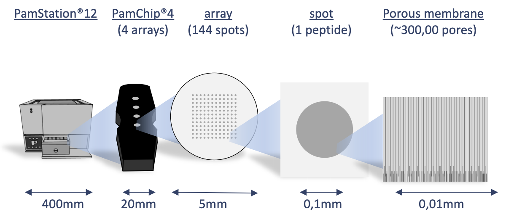
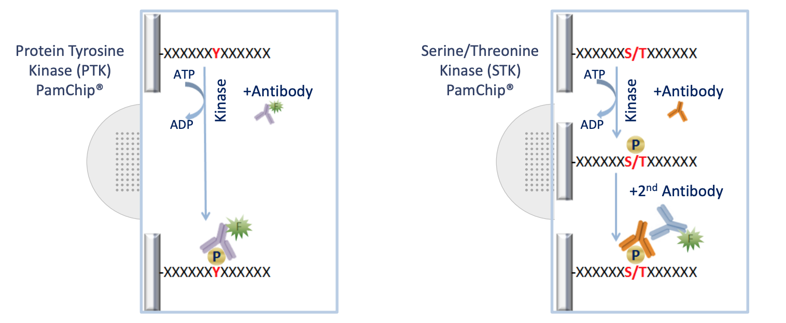

```{r libraries&functions, include=FALSE}
# loading Libraries ----
library(tidyverse)
library(KRSA)
library(broom)
library(pheatmap)
library(gt)
library(knitr)
library(furrr)


knitr::opts_chunk$set(echo = TRUE, message = FALSE, warning = FALSE)


```


```{r, echo=F,out.width = "200px",out.width="200px", fig.align='center'}
knitr::include_graphics("images/ut_collegeofmedicine-logo.png")
```


\hfill\break
\hfill\break
\hfill\break
\hfill\break
\hfill\break
\hfill\break
\hfill\break
\hfill\break  
\centering  
\fontfamily{qpl}\selectfont
\LARGE\textbf{Kinase Array Report (STK)}  

\footnotesize{The Cognitive Disorders Research Laboratory (CDRL)}  

\scriptsize{The Department of Neurosciences at the University of Toledo Medical Center} 

\fontfamily{cmr}\selectfont
\normalsize
\justify

***

\newpage


### Introduction 

#### Background
The Pamstation12 instrument provides a profiling of kinase activity of cell or tissue samples. The device is loaded with either serine/threonine or tyrosine microarray chips. Each chip has 4 wells so four samples can be loaded on a single chip, and the Pamstation12 can accommodate 3 chips per run. The microarray represents 144 (STK chip) or 196 (PTK chip) reporter peptides that can be phosphorylated by serine/threonine or tyrosine kinases. The device measures the degree of the phosphorylation in real time by detecting fluorescently labeled antibodies at different exposure times. The list of peptides present in each microarray can be viewed here: [STK chip](https://pamgene.com/wp-content/uploads/2020/09/STK-144-PamChip-87102.pdf), [PTK chip](https://pamgene.com/wp-content/uploads/2020/09/PTK-196-PamChip-86402.pdf)

\newpage
 

```{r, echo=F,out.width = "400px",out.width="450px", fig.align='center'}


```

\newpage  

#### Samples Info  


#### Run Design
Designing the placement of the samples on the chips and arrays is important to consider due to the variability across different chips and batches. During the run some wells are subject to fail and their data cannot be analyzed and shown below as red.

```{r design, echo=F, fig.width=3, fig.height=3, fig.align="center"}
tt <- tibble(
  num = rep(c(3.5,2.5,1.5,0.5),3),
  chips = rep(c(2,5,8),each=4),
  colr = c(rep(1,12)),
  nms = rep(c("A", "B", "C", "D"), 3)
)
rundes <- ggplot() +
  geom_rect(aes(xmin=1, xmax=3, ymin=0,ymax=4), fill="gray30") +
  geom_rect(aes(xmin=4, xmax=6, ymin=0,ymax=4), fill="gray30") +
  geom_rect(aes(xmin=7, xmax=9, ymin=0,ymax=4), fill="gray30") +
  xlim(0,10) + 
  theme_void() 

rundes + geom_point(data = tt, aes(chips, num,color=factor(colr)), size = 13, show.legend = F) +
  geom_text(data = tt, aes(chips,num,label = nms), size = 2) +
  scale_color_manual(values=c("green3", "red3"))
```

\newpage

## Results  

#### Image Anlaysis
The first step of analyzing the run is to convert the images taken by the PamStation of each array at different exposure times to numerical values This is done by the Bionavigator software developed by Pamgene. The software recognizes the grid of the array with the aid of the searching algorithm (Pamgrid) to correctly identify each spot on the array. The numbers produced by this software represent the median value of the foreground pixels minus the median value of the background pixels to produce the median signal minus background (Median_SigmBg).

#### Data Tidying and Modeling  
The raw data is then transformed to be tidy for an easier analysis, modeling, and visualizing. In order to combine the values from different exposure times into a single value, a simple linear regression model of the *Medain_SigmBg* as a function of exposure time is fitted. The slope of of the model fit and $R^2$ are then used for quality control and samples comparison. The slope is also scaled by multiplying by 100 and log2 transformed (*Slope_Transformed*).


```{r read and qc, include=FALSE}

# Define chip type
chipType <- "STK"

# Read crosstab files 
data <- krsa_read("data_files/example_Median_SigmBg.txt", "data_files/example_Signal_Saturation.txt")

# qc processing
krsa_qc_steps(data) -> data

# Define sample groups
data %>% mutate(Group = SampleName, SampleName = paste0(SampleName,"_" ,Barcode)) -> data

# PW @ all mix exposure time (200ms)
krsa_extractEndPointMaxExp(data, chipType) -> data_pw_200

# end level @ all exposure times
krsa_extractEndPoint(data, chipType) -> data_pw 


```

```{r model, warning=F,include=FALSE}

# 
krsa_filter_lowPeps(data_pw_200, 5) -> ppPassAll
krsa_scaleModel(data_pw, ppPassAll) -> data_modeled
  
krsa_filter_nonLinear(data_modeled$scaled, 0.8) -> ppPassR2

krsa_filter_ref_pep(ppPassR2) -> new_pep


```

#### Global Signal Intensity  
For a global signal intensity across all samples/groups, a heatmap is constructed based on the *Slope_Transformed* values. This heatmap represents all the peptides present on the chip except the positive/internal controls and peptides that failed to pass QC. The heatmap is scaled by row to highlight the peptide signal differences across the samples. A hierarchical unsupervised clustering is applied both on the peptides and the samples to potentially group similar signatures. 


```{r heatmapPlot, echo=F,fig.height=6, fig.width=6, fig.align="center"}

krsa_cv_plot(data_modeled$scaled, ppPassR2)
krsa_cv_plot(data_modeled$normalized, ppPassR2)

krsa_violin_plot(data_modeled$scaled, ppPassR2, "Group")
krsa_violin_plot(data_modeled$scaled, ppPassR2, "Barcode")

krsa_heatmap(data_modeled$scaled, ppPassR2)
krsa_heatmap(data_modeled$normalized, ppPassR2)
krsa_heatmap_grouped(data_modeled$grouped, ppPassR2)


```

#### Group Comparsion
To compare between samples, a two-group comparison is performed. In this case, the two group comparisons are:    

* B vs A   
 
The *Slope_Transforemed* ratio between each group, paired by chip, is calculated to represent the final peptide signal to be used to calculate the fold change. Based on the fold change, peptides that pass a certain fold change threshold are considered significant hits. Also, quality control steps applied in each comparison to filter out peptides that do not reach specific criteria:  

* The *Medain_SigmBg* at max exposure *200ms* must be above a certain value   
* $R^2$ of the linear model fit must be above a threshold value 

These *Filtering Parameters* (fold change threshold, QC criteria) can be modified to adjust the stringency of the analysis. The *Filtering Parameters* that are used for this analysis:

* The *Medain_SigmBg* at max exposure *200ms* must be equal or above 5       
* $R^2$ of the linear model fit must be above or equal 0.9  
* Log fold change (LFC) cutoffs at (0.2,0.3)


```{r,echo=F, fig.height=8,fig.width=7}


comparisons <- list(Comp1 = c("B", "A"))


krsa_quick_filter(data = data_pw_200, data2 = data_modeled$scaled,
    signal_threshold = 5, r2_threshold = 0.9,
    groups = comparisons$Comp1) -> pep_passed_qc

krsa_group_diff(data_modeled$scaled, comparisons$Comp1, pep_passed_qc, byChip = T) -> diff_df


krsa_get_diff(diff_df,totalMeanLFC ,c(0.2,0.3)) %>% list("meanLFC" = .) -> sigPeps
krsa_get_diff_byChip(diff_df, LFC, c(0.2,0.3)) -> sigPepsPerChip


sigPeps_total <- list(sigPeps, sigPepsPerChip) %>% unlist(recursive = F) %>%  unlist(recursive = F)


```
\newpage 

#### B vs A   
After applying the *Filtering Parameters* for this group comparison, only *`r length(sigPeps$meanLFC$`0.2`)`*/141 peptides carried forward in the analysis (i.e. *`r length(sigPeps$meanLFC$`0.2`)` hits*). Below are some figures to visualize the differences between these samples for considering these *hits*.  

```{r,echo=F, fig.align="center", fig.height=6, fig.width=6}

krsa_heatmap(data_modeled$normalized, sigPeps$meanLFC$`0.2`, groups = comparisons$Comp1)

```
\newpage  

#### B vs A 
```{r,echo=F, fig.align="center"}
krsa_violin_plot(data_modeled$scaled, sigPeps$meanLFC$`0.2`, "Barcode", groups = comparisons$Comp1)

```
\newpage  

#### B vs A   
```{r, echo=F, fig.align="center", fig.height=8,fig.width=6}
krsa_waterfall(diff_df, 0.2)
```
\newpage  

#### B vs A   
```{r , echo=F,fig.align="center", fig.width=15, fig.height=15}
krsa_curve_plot(data_pw, sigPeps$meanLFC$`0.2`, groups = comparisons$Comp1)
```
\newpage  
#### B vs A  
##### Upstream Kinase Anlaysis  
The lab carefully curated and mapped the kinases that can act and phosphorylate each peptide present on the chip. This was achieved by using multiple sources including GPS 3.0, Kinexus Phosphonet, PhosphoELM and PhosphoSite Plus. Based on that association between peptides and kinases, a random sampling analysis is performed for these hits. This is done by using Kinome Random Sampling Analyzer (*KRSA*). *KRSA* is a software tool developed by the lab to perform the random sampling analysis. The basic idea of *KRSA* is: For each iteration (*2000* iterations performed in this analysis), the same number of hits are randomly selected from the total 141/or 193 peptides present on the chip. Predicted kinases are then mapped to this sample list of peptides and number of kinases are determined. The kinase count from the actual hits and random sampling is then compared to determine the significance.

```{r , echo=F, warning=F, fig.align="center", message=FALSE}
set.seed(123)

chipCov <- KRSA_coverage_STK_PamChip_87102_v1
KRSA_file <- KRSA_Mapping_STK_PamChip_87102_v1

krsa(sigPeps$meanLFC$`0.2`, return_count = T) -> fin

kable(head(fin$KRSA_Table,25), digits = 3)

# save file
#fin$KRSA_Table %>% write_delim("acrossChip_KRSA_FullTable_comp1.txt", delim = "\")

bothways <- c(pull(head(fin$KRSA_Table, 10), Kinase), pull(tail(fin$KRSA_Table, 10), Kinase))

krsa_histogram_plot(fin$KRSA_Table, fin$count_mtx, bothways)

library(future)
plan(multisession)

future_map(sigPeps_total, krsa) -> mutiple_krsa_outputs

df <- data.frame(matrix(unlist(mutiple_krsa_outputs), ncol = max(lengths(mutiple_krsa_outputs)), byrow = TRUE))
df <- setNames(do.call(rbind.data.frame, mutiple_krsa_outputs), names(mutiple_krsa_outputs$meanLFC.0.2))


df %>% rownames_to_column("method") %>% select(Kinase, Z, method) %>% 
  mutate(method = str_extract(method, "\\w+\\.\\w+\\.\\w+")) %>% 
  mutate(method = gsub("(^\\w+)[\\.]", "\\1>", method)) %>% 
  mutate_if(is.numeric, round, 2) -> df

df %>% 
  pivot_wider(names_from = method, values_from = Z) -> df2
  

df2 %>% 
  gt() %>% tab_spanner_delim(delim = ">")

df %>% 
  filter(grepl("mean", method)) %>% 
  select(Kinase, Z, method) %>% group_by(Kinase) %>% mutate(AvgZ = mean(Z)) -> AvgZTable

# save file
#AvgZTable %>% write_delim("acrossChip_KRSA_Table_comp1.txt", delim = "\")

df %>% 
  filter(!grepl("mean", method)) %>% 
  select(Kinase, Z, method) %>% group_by(Kinase) %>% mutate(AvgZ = mean(Z)) -> AvgZTable2

# save file
#AvgZTable %>% write_delim("withinChip_KRSA_Table_comp1.txt", delim = "\")

krsa_top_hits(AvgZTable2, 2) -> kinases_hits
krsa_top_hits(AvgZTable2, 1.75)
krsa_top_hits(AvgZTable2, 1.5)


krsa_show_peptides(sigPeps_total) %>% gt()

```
\newpage 

#### B vs A 
```{r, echo=F, warning=F, fig.align="center", fig.height=8,fig.width=6}

krsa_zscores_plot(AvgZTable)
krsa_zscores_plot(AvgZTable2)

```
\newpage 


#### B vs A 
```{r, echo=F, warning=F, fig.align="center"}
krsa_reverse_krsa_plot(chipCov, diff_df, kinases_hits, 0.2)
```
\newpage

#### B vs A   
```{r , echo=F, fig.align="center", fig.height=8,fig.width=6}

krsa_coverage_plot(chipCov, AvgZTable2, chipType)

```
\newpage

#### B vs A   
```{r , echo=F, fig.align="center", fig.height=10,fig.width=10, message=FALSE}
library(igraph)

krsa_ball_model(kinases_hits, AvgZTable2, 10, 2.5, 4.8)

```

```{r}
installed.packages()[names(sessionInfo()$otherPkgs), "Version"]
```
