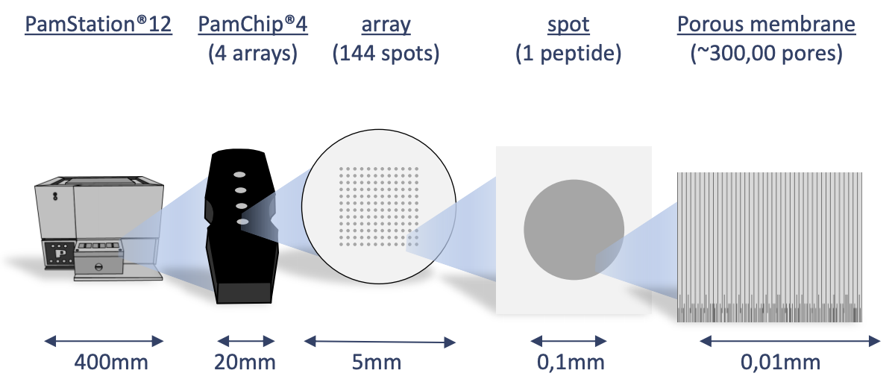

```{r, include = FALSE}
knitr::opts_chunk$set(
  collapse = TRUE,
  comment = "#>",
  echo=FALSE,
  message = FALSE
)
```

```{r setup}
library(KRSA)
library(knitr)
library(tidyverse)

library(gt) # can be used to view tables
library(furrr) # can be used for parallel computing 
```

\newpage

# Introduction

## Background

The Pamstation12 instrument provides a profiling of kinase activity of cell or tissue samples. The device is loaded with either serine/threonine or tyrosine microarray chips. Each chip has 4 wells so four samples can be loaded on a single chip, and the Pamstation12 can accommodate 3 chips per run. The microarray represents 144 (STK chip) or 196 (PTK chip) reporter peptides that can be phosphorylated by serine/threonine or tyrosine kinases. The device measures the degree of the phosphorylation in real time by detecting fluorescently labeled antibodies at different exposure times. The list of peptides present in each microarray can be viewed here: [STK chip](https://pamgene.com/wp-content/uploads/2020/09/STK-144-PamChip-87102.pdf), [PTK chip](https://pamgene.com/wp-content/uploads/2020/09/PTK-196-PamChip-86402.pdf)

\newpage

```{r, echo=F,out.width = "400px",out.width="450px", fig.align='center', cache=TRUE}

knitr::include_graphics("images/pamgene_detectionFig.png")
```

\newpage

# Results

## Image Analysis

The first step of analyzing the run is to convert the images taken by the PamStation of each array at different exposure times to numerical values This is done by the Bionavigator software developed by Pamgene. The software recognizes the grid of the array with the aid of the searching algorithm (Pamgrid) to correctly identify each spot on the array. The numbers produced by this software represent the median value of the foreground pixels minus the median value of the background pixels to produce the median signal minus background (Median_SigmBg).

## Reading Data

The first step will be reading the crosstab view bionavigator files (Median_SigmBg and Signal_Saturation) and defining the PamChip type (STK or PTK). The raw data is read and then transformed to be in tidy format for an easier analysis, modeling, and visualizing.

```{r readData, include=T, cache=TRUE}

# Define chip type. STK or PTK
chipType <- "STK"

# Read crosstab view bionavigator files and tidy data
data <- krsa_read("input_data/Median_SigmBg File", "input_data/Signal Saturation File")

```

## QC Initial Steps and Groups Assignments

We will perform a couple of quality control steps to deal with negative values in the data and adjust based on signal saturation (optional). Next, we will define a new column to represent the grouping. And then, we will extract end point signal values

```{r qcSteps, include=T, cache=TRUE}
# qc processing
krsa_qc_steps(data) -> data

# Define sample groups
data %>% mutate(Group = SampleName, SampleName = paste0(SampleName,"_" ,Barcode)) -> data

# extract end level signal values @ all max exposure time (200ms)
krsa_extractEndPointMaxExp(data, chipType) -> data_pw_200

# extract end level signal values end level @ all exposure times
krsa_extractEndPoint(data, chipType) -> data_pw 


```

## QC Steps and Model Fitting

We will filter out peptides with low signals. In order to combine the values from different exposure times into a single value, a simple linear regression model of the *Medain_SigmBg* as a function of exposure time is fitted. The slope of of the model fit and $R^2$ are then used for quality control and samples comparison. The slope is also scaled by multiplying by 100 and log2 transformed (*Slope_Transformed*). We then filter out peptides with poor linear fit and references peptides.

```{r model, warning=F,include=T, cache=TRUE}

# Fit the linear model
# This will produce a list of data frames:
# scaled: the Slope_Transformed values (see above for more info on Slope_Transformed)
# normalized: the Slope_Transformed values but normalized by Chip/Barcode
# Grouped: The mean of Slope_Transformed values for all samples within a group
krsa_scaleModel(data_pw,unique(data_pw$Peptide)) -> data_modeled

# Filter out peptides with low signals
krsa_filter_lowPeps(data_pw_200, 5) -> ppPassAll

  
# Filter out peptides weak linear fit
krsa_filter_nonLinear(data_modeled$scaled %>% filter(Peptide %in% ppPassAll), 0.9) -> ppPassR2

# Filter out reference peptides
krsa_filter_ref_pep(ppPassR2) -> new_pep


```

## Global Signal Intensity

For a global signal intensity across all samples/groups, few figures can be plotted based on the *Slope_Transformed* values.

### Global CV Plots

We will plot the coefficient of variation on both the normal and normalized fits. This will help us to identify groups with high variation that could be explained by sample outliers.

```{r cvPlot, echo=F,fig.height=8, fig.width=8, fig.align="center", cache=TRUE}

# Plot a CV figure using the modeled scaled data
krsa_cv_plot(data_modeled$scaled, new_pep)

# Plot a CV figure using the modeled normalized data
krsa_cv_plot(data_modeled$normalized, new_pep)
```

### Global Violin Plots

We will plot violin figures to examine global signal differences between groups/samples.

```{r violinPlot, echo=F,fig.height=8, fig.width=8, fig.align="center", cache=TRUE}
# Plot a violin figure and facet by the (Group) variable
krsa_violin_plot(data_modeled$scaled, new_pep, "Group")

# Plot a violin figure and facet by the (Barcode) variable
krsa_violin_plot(data_modeled$scaled, new_pep, "Barcode")

# Plot a grouped violin figure
krsa_violin_plot_grouped(data_modeled$scaled, new_pep)

```

### Global Heatmaps

The heatmap represent all the peptides present on the chip except the positive/internal controls and peptides that failed to pass QC. The heatmaps are scaled by row to highlight the peptide signal differences across the samples. A hierarchical unsupervised clustering is applied both on the peptides and the samples to potentially group similar signatures.

```{r heatmapPlot, echo=F,fig.height=8, fig.width=8, fig.align="center", cache=TRUE}

# Generates a heatmap using the modeled scaled data
krsa_heatmap(data_modeled$scaled, new_pep, scale = "row")

# Generates a heatmap using the modeled normalized data
krsa_heatmap(data_modeled$normalized, new_pep, scale = "row")

# Generates a heatmap using the modeled grouped data
krsa_heatmap_grouped(data_modeled$grouped, new_pep, scale = "row")


```

## Group Comparison

To compare between samples, a two-group comparison is performed. In this case, the two group comparisons are:

-   **B vs A**

The *Slope_Transforemed* ratio between each group, paired by chip, is calculated to the fold change. Based on the fold change, peptides that pass a certain fold change threshold are considered significant hits. Also, quality control steps applied in each comparison to filter out peptides that do not reach specific criteria:

-   The *Medain_SigmBg* at max exposure *200ms* must be above a certain value\
-   $R^2$ of the linear model fit must be above a threshold value

These *Filtering Parameters* (fold change threshold, QC criteria) can be modified to adjust the stringency of the analysis. The *Filtering Parameters* that are used for this analysis:

-   The *Medain_SigmBg* at max exposure *200ms* must be equal or above 5\
-   $R^2$ of the linear model fit must be above or equal 0.9\
-   Log fold change (LFC) cutoffs at (0.2,0.3,0.4)

```{r groupDiff,echo=F, fig.height=8,fig.width=8,fig.align="center", cache=TRUE}

# Define Groups to be compared
comparisons <- list(Comp1 = c("B", "A"))

# This function will run both QC steps (krsa_filter_lowPeps, krsa_filter_nonLinear) and krsa_filter_ref_pep
krsa_quick_filter(data = data_pw_200, data2 = data_modeled$scaled,
    signal_threshold = 5, r2_threshold = 0.9,
    groups = comparisons$Comp1) -> pep_passed_qc

# This function calculates log2 fold change values between the defined groups
# The byChip argument lets you calculates the log2 fold change the results within each chip
krsa_group_diff(data_modeled$scaled, comparisons$Comp1, pep_passed_qc, byChip = T) -> diff_df

# save LFC table
write_delim(diff_df, "output/LFC_tables/comp1_LFC_df.txt", delim = "\t")

# Extract top peptides based on the LFC cutoff using average of LFCs across chips
krsa_get_diff(diff_df,totalMeanLFC ,c(0.2,0.3,0.4)) %>% list("meanLFC" = .) -> sigPeps

# Extract top peptides based on the LFC cutoff using average of LFCs across chips with a standard deviation cutoff (sd_thr). in this example the sd_thr is set as 0.5 but that could be adjusted by user (uncomment next line to account for LFC sd)
# krsa_get_diff(diff_df,totalMeanLFC ,c(0.2,0.3), sd_thr = 0.5) %>% list("meanLFC" = .) -> sigPeps

# Extract top peptides based on the LFC cutoff using per chip LFCs
krsa_get_diff_byChip(diff_df, LFC, c(0.2,0.3,0.4)) -> sigPepsPerChip

# Combine the peptides hits in one list
sigPeps_total <- list(sigPeps, sigPepsPerChip) %>% unlist(recursive = F) %>%  unlist(recursive = F)


```

\newpage

### B vs A (Heatmap)

After applying the *Filtering Parameters* for this group comparison, only *`r length(sigPeps$meanLFC[["0.2"]])`* peptides carried forward in the analysis (i.e. *`r length(sigPeps$meanLFC[["0.2"]])` hits*). Below are some figures to visualize the differences between these samples for considering these *hits*.

```{r heatmapInd,echo=F, fig.align="center", fig.height=8, fig.width=8, cache=TRUE}

# generates a heatmap using the selected groups and peptides
krsa_heatmap(data_modeled$normalized, sigPeps$meanLFC$`0.2`, groups = comparisons$Comp1, scale = "row")

```

\newpage

### B vs A (Violin Plot)

```{r violinIndPlot,echo=F, fig.align="center", fig.height=8, fig.width=8, cache=TRUE, message=FALSE}
# generates a violin plot using the selected groups and peptides
krsa_violin_plot(data_modeled$scaled, sigPeps$meanLFC$`0.2`, "Barcode", groups = comparisons$Comp1)

# generate a grouped violin/boxplot plot using the selected groups and peptides with more options, like a statistical test. check krsa_violin_plot_grouped() arguments for more options
krsa_violin_plot_grouped(data_modeled$scaled, sigPeps$meanLFC$`0.2`, comparisons, 
                         dots = F,
                         groups = comparisons$Comp1, avg_line = T)


krsa_violin_plot_grouped(data_modeled$grouped, sigPeps$meanLFC$`0.2`, comparisons, 
                         test = F, 
                         groups = comparisons$Comp1, avg_line = T)

```

\newpage

### B vs A (Waterfall Plot)

This waterfall represents the log2 fold changes between the two groups at each peptide.

```{r waterfall, echo=F, fig.align="center", fig.height=8,fig.width=8, cache=TRUE}
# generates a waterfall of the log2 fold change values for the selected peptide (top peptides)
krsa_waterfall(diff_df, lfc_thr = 0.2, byChip = T)

# generates a waterfall of the log2 fold change values for the selected peptide (top peptides) with a standard deviation cutoff (sd_thr). This is just for the waterfall not the actual upstream kinase analysis (that must be set with the krsa_get_diff function)
krsa_waterfall(diff_df, lfc_thr = 0.2, byChip = T, sd_thr = 0.5)
```

\newpage

### B vs A (Curve Plot)

We generate curves plots per peptide using the last cycle data to visualize the linear fit model

```{r curvePlot, echo=F,fig.align="center", fig.height=8, fig.width=8, cache=TRUE}
# generates a curve plot representing the linear model fit for the selected peptide (top peptides, only showing 10 here)
krsa_curve_plot(data_pw, sigPeps$meanLFC$`0.2`[1:10], groups = comparisons$Comp1)
```

### B vs A (Upstream Kinase Analysis)

The lab carefully curated and mapped the kinases that can act and phosphorylate each peptide present on the chip. This was achieved by using multiple sources including GPS 3.0, Kinexus Phosphonet, PhosphoELM and PhosphoSite Plus. Based on that association between peptides and kinases, a random sampling analysis is performed for these hits. The basic idea of *KRSA* is: For each iteration (*2000* iterations performed in this analysis), the same number of hits are randomly selected from the total 141/or 193 peptides present on the chip. Predicted kinases are then mapped to this sample list of peptides and number of kinases are determined. The kinase count from the actual hits and random sampling is then compared to determine the significance.

```{r krsa, echo=F, warning=F, message=FALSE, fig.align="center", fig.height=8, fig.width=8, cache=TRUE}


# load in chip coverage and kinase-substrate files OR upload your own files
# if PTK chip, use:
# chipCov <- KRSA_coverage_PTK_PamChip_86402_v1
# KRSA_file <- KRSA_Mapping_PTK_PamChip_86402_v1

# STK chip
chipCov <- KRSA_coverage_STK_PamChip_87102_v2
KRSA_file <- KRSA_Mapping_STK_PamChip_87102_v1


# run the KRSA function to do the random sampling analysis, set seed that can be used later to reproduce results, and choose number of iterations
krsa(sigPeps$meanLFC$`0.2`, return_count = T, seed = 123, itr = 2000,
     map_file = KRSA_file, cov_file = chipCov) -> fin

# View the Z score table
kable(head(fin$KRSA_Table,25), digits = 3)

# to save file
fin$KRSA_Table %>% write_delim("output/Z_Scores_tables/acrossChip_KRSA_FullTable_comp1.txt", delim = "\t")

# find top and bottom kinases
bothways <- c(pull(head(fin$KRSA_Table, 10), Kinase), pull(tail(fin$KRSA_Table, 10), Kinase))

# Use these kinase to generate histogram plots for each selected kinase
krsa_histogram_plot(fin$KRSA_Table, fin$count_mtx, bothways)


# For parallel computing, load the furrr package:
# opens multiple R sessions to run faster
plan(multisession)

# Run the KRSA function across the different sets of peptides using the furrr package for parallel computing
future_map(sigPeps_total, krsa) -> mutiple_krsa_outputs


# For none parallel computing:
# Run KRSA function across the different sets of peptides
#map(sigPeps_total, krsa) -> mutiple_krsa_outputs

# Tidy output
df <- data.frame(matrix(unlist(mutiple_krsa_outputs), ncol = max(lengths(mutiple_krsa_outputs)), byrow = TRUE))
df <- setNames(do.call(rbind.data.frame, mutiple_krsa_outputs), names(mutiple_krsa_outputs$meanLFC.0.2))

df %>% rownames_to_column("method") %>% select(Kinase, Z, method) %>% 
  mutate(method = str_extract(method, "\\w+\\.\\w+\\.\\w+")) %>% 
  mutate(method = gsub("(^\\w+)[\\.]", "\\1>", method)) %>% 
  mutate_if(is.numeric, round, 2) -> df

df %>% 
  pivot_wider(names_from = method, values_from = Z) -> df2
  
# Generates a table of the Z scores across the different sets of peptides
# df2 %>% 
#   gt() %>% tab_spanner_delim(delim = ">")

# Creates an average Z score table using the across chip analysis
df %>% 
  filter(grepl("mean", method)) %>% 
  select(Kinase, Z, method) %>% group_by(Kinase) %>% mutate(AvgZ = mean(Z)) -> AvgZTable

# save file
AvgZTable %>% write_delim("output/Z_Scores_tables/acrossChip_KRSA_Table_comp1.txt", delim = "\t")

# Creates an average Z score table using the within chip analysis
df %>% 
  filter(!grepl("mean", method)) %>% 
  select(Kinase, Z, method) %>% group_by(Kinase) %>% mutate(AvgZ = mean(Z)) -> AvgZTable2

# save file
AvgZTable %>% write_delim("output/Z_Scores_tables/withinChip_KRSA_Table_comp1.txt", delim = "\t")

# Extract top kinases based on abs(Z) score
krsa_top_hits(AvgZTable2, 2) -> kinases_hits

#krsa_top_hits(AvgZTable2, 1.75)
#krsa_top_hits(AvgZTable2, 1.5)

# Show the number of peptides per each set in atable
krsa_show_peptides(sigPeps_total)

```

\newpage

### B vs A (Z Scores Plot)

We will plot the individual and averaged Z scores using both the across and within chip analyses.

```{r zscoresPlot, echo=F, warning=F, fig.align="center", fig.height=10,fig.width=8, cache=TRUE}

# Generates Z scores waterfall plots
krsa_zscores_plot(AvgZTable)
krsa_zscores_plot(AvgZTable2)

```

\newpage

### B vs A (Reverse KRSA Plot)

We will use the reverse KRSA plot function, to plot the log2 fold chnage values for all peptides mapped to kinase hits. This will help us examine the activity of the kinase

```{r revKRSAPlot, echo=F, warning=F, fig.align="center", fig.height=8, fig.width=8, cache=TRUE}

# plot the reverse KRSA figure for top kinases to determine their activity levels
krsa_reverse_krsa_plot(chipCov, diff_df, kinases_hits, 0.2, byChip = F)
```

\newpage

### B vs A (Coverage Plot)

To view the coverage of kinases across the full list of peptides on the chip, we will use the coverage plot function

```{r covPlot, echo=F, fig.align="center", fig.height=10,fig.width=8, cache=TRUE}

# generates a kinase coverage plot 
krsa_coverage_plot(chipCov, AvgZTable2, chipType)

```

\newpage

### B vs A (Ball Model Network)

We will view the ball model network function, to generate a model representing the protein-protein interactions between kinases

```{r netPlot, echo=F, fig.align="center", fig.height=10,fig.width=8, message=FALSE, cache=TRUE}

# Plot the network ball model
krsa_ball_model(kinases_hits, AvgZTable2, 10, 2.5, 4.8)


```

#### Session Info

```{r}
installed.packages()[names(sessionInfo()$otherPkgs), "Version"]
```
